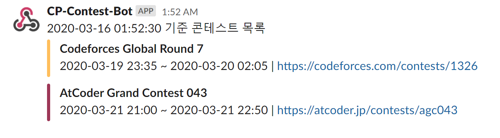

어케해
* Slack에 Incoming, Outgoing WebHooks 하나씩 설치
* Slack의 Outgoing에 Lambda API Gateway 트리거를 붙여주고
* Lambda에서 post request를 Incoming에다가 해주면 됨

가져오는거
* 코포
* 앳코더
* 더 있을까

무식하게 AWS Lambda 앱 하나 만들기

1. Install dependencies
```
pip install bs4 requests -t .
```

2. Configure lambda_function.py, lambda_handler()

3. Upload zip to Lambda function code, configure ENV

4. Configure trigger(API Gateway for general trigger, CloudWatch for cron, ...)


TODO

* Atcoder support
* serverless
* layer for dependencies

참고

* https://codeforces.com/apiHelp/objects#Contest
